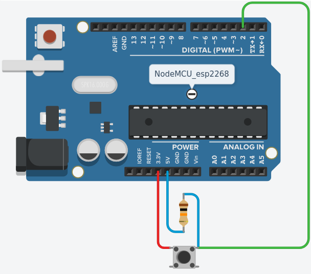
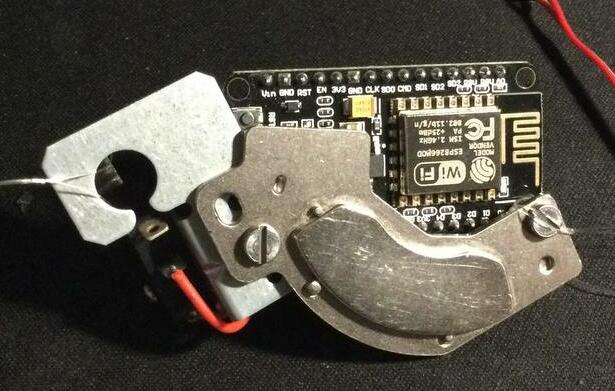
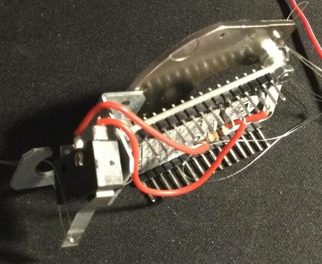

# connectedMailbox
<p align="center"></p>

Arduino connected mailbox 

**The principle could not be simpler: The MCU node is connected to your wifi, and notifies you when mail arrives in your mailbox**

> The `docs` directory does not contains any doc ... its just the web interface for th epublic workfow ;p

## Circuit



## Examples




## Todo :
- [ ] For the web interface : be sure to only select worflow related to the arduino 


## Notes
> Just to remember
```bash
curl -H "Accept: application/vnd.github+json" -H "Authorization: token <TOKEN>" --request POST --data '{"event_type": "do-something", "client_payload": { "content": "Strawberry"}}' https://api.github.com/repos/lostsh/connectedMailbox/dispatches
```